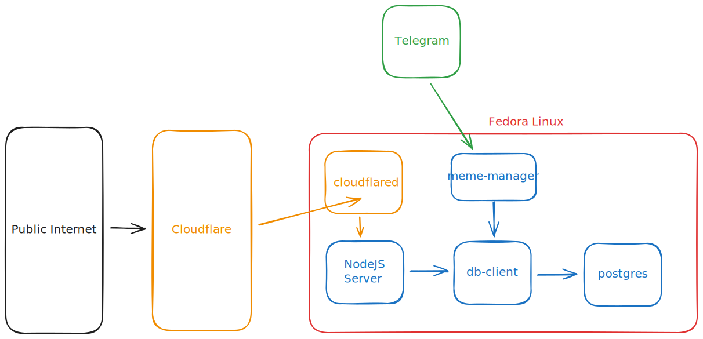

# Overview
This is the source code for [asteurer.com](https://asteurer.com).

## Features
- I am able to text meme images to a Telegram bot, and the memes will be accessible on the website

## Technologies

- The website is run on a ***multi-node Kubernetes cluster***, and is accessible via ***Cloudflare Tunnels***
- ***Helm*** is used to configure and deploy the various resources needed to run the application stack
- ***Terraform*** is used to spin up an ***AWS S3*** bucket with an accompanying service account for the `meme-manager` application
- I used ***Svelte*** (a JavaScript framework) for the front end
- The back-end portion uses ***Postgres*** and ***Golang***
- The `db-client` application has ***automated tests***
- In the `Makefile`, I automated various repetitive tasks, improving my development workflow

## Design


### Telegram Bot and meme-manager
- Sending image data to S3 via an API was tedious and exposed PUT and DELETE operations to the public internet. Telegram made it possible to manage the image data by pulling from Telegram's servers via `meme-manager`, rather than having to manage authentication for pushing directly to the website's servers.

### Front end state management
- I wanted a user to be able to traverse memes and retrace their steps without having to store any session data. I decided to use a linked-list, and routes as a way to retrieve the image data for the previous and next memes.

### Cloudflare Tunnels
- I used Cloudflare Tunnels because I wanted to host my website on my home server, but I didn't want to expose my home IP address or manage a firewall.

# For Andrew's reference

## Restoring Postgres

You'll need to copy the backup data to the container, delete the memes table, and then restore the data:

```sh
kubectl cp ./postgres.dump <CONTAINER ID>:/tmp/postgres.dump
kubectl exec -it <CONTAINER ID> -- bash

# The below commands are run within the postgres container
su postgres
psql

# The below commands are run from within psql
\c postgres
drop table memes;
\q

# The below commands are run from within the postgres container
pg_restore -U postgres -d postgres /tmp/postgres.dump
```