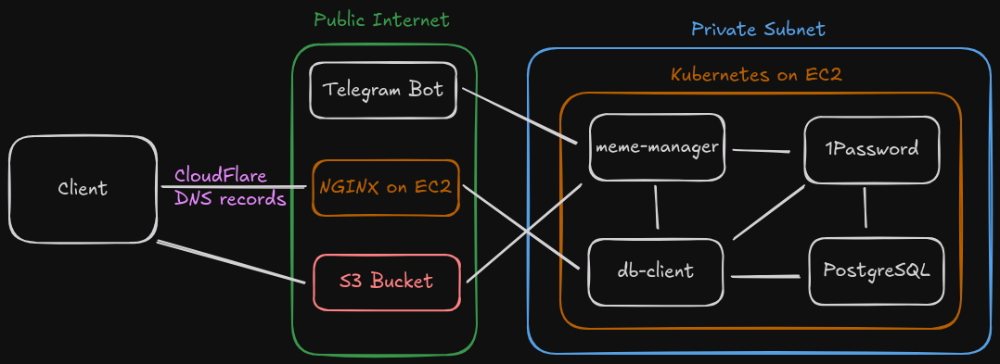

# Overview

This is the source code for [asteurer.com](https://asteurer.com).

## Technologies

- The infrastructure for this website is managed with ***Terraform***, which was chosen because the project uses resources from both ***AWS*** and ***CloudFlare***.
- Various ***Python*** and ***Bash*** scripts were written so the website could be up-and-running from scratch in less than 10 minutes.
- The front-end of the project is PHP and HTML files served via ***NGINX***, and encrypted with ***TLS certificates***.
- The back-end portion is a ***Kubernetes*** cluster, running a ***Helm*** deployment containing ***Postgres*** and ***Golang*** applications.
- ***Secrets automation*** is accomplished using 1Password's CLI and Kubernetes Connect Server.

## Design

### Telegram Bot and meme-manager
- Sending image data to S3 via an API was tedious and exposed PUT and DELETE operations to the public internet. Telegram made it possible to manage the image data by pulling from Telegram's servers via `meme-manager`, rather than having to manage authentication for pushing directly to the website's servers.

### NGINX, S3 bucket, and db-client
- When visiting the [meme gallery](https://asteurer.com/memes), the PHP queries the `db-client` via a private IP address, which then returns a doubly-linked list node containing the S3 URL for a particular meme, and the IDs for the previous and next meme relative to the particular meme. This allows for stateful-like behavior from a stateless application.

- S3 was intentionally configured to allow public GET requests. This allowed for NGINX to serve HTML and the client to retrieve the image data directly from S3, rather than making unnecessary steps to retrieve the image data from S3 via NGINX.